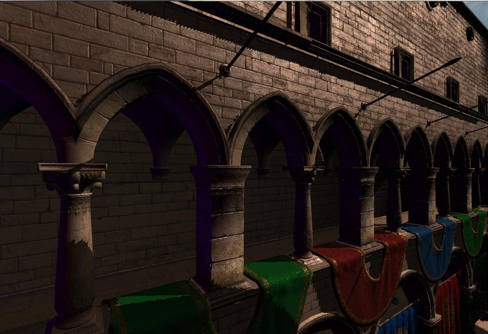
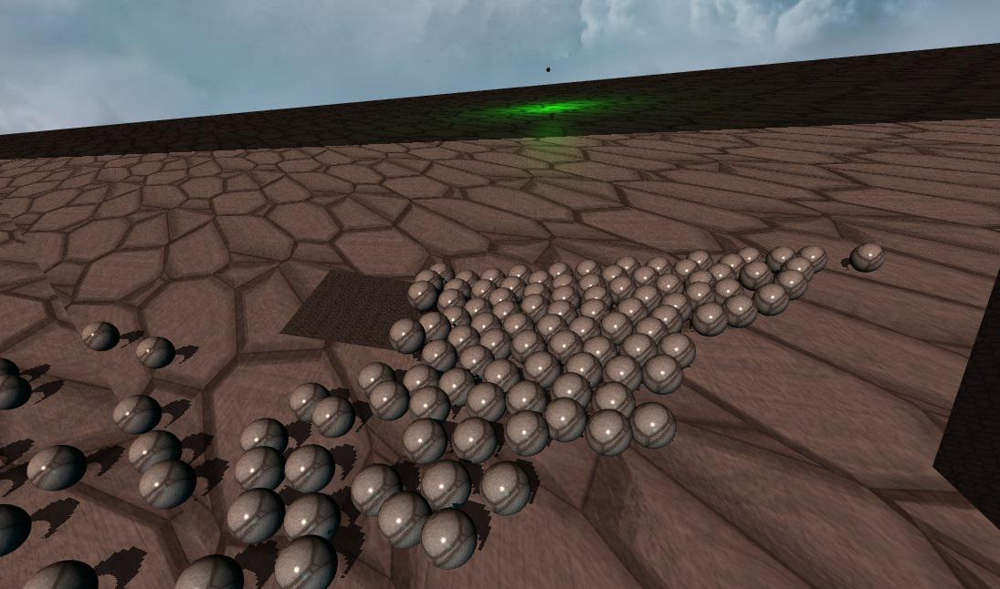

Compilé sous Windows avec MinGW et CodeBlocks.

### Fonctionnalités

- OpenGL moderne 3.x/4.x
- Lumières dynamiques ponctuelles et directionnelles
- Diffuse + Specular + Normal mapping
- Shadow Mapping
- Instanciation Géométrique
- Loader de .obj + les .mtl pour les différentes textures
- Edition et rechargement à la volée des shaders
- Moteur physique avec collisions de sphères et de plans

### Librairies
- SDL2
- SDL2_image
- GLEW

---

#### Rendus####

*Sponza model from Crytek*

---

*200 sphères avec des plans statiques et dynamiques*
